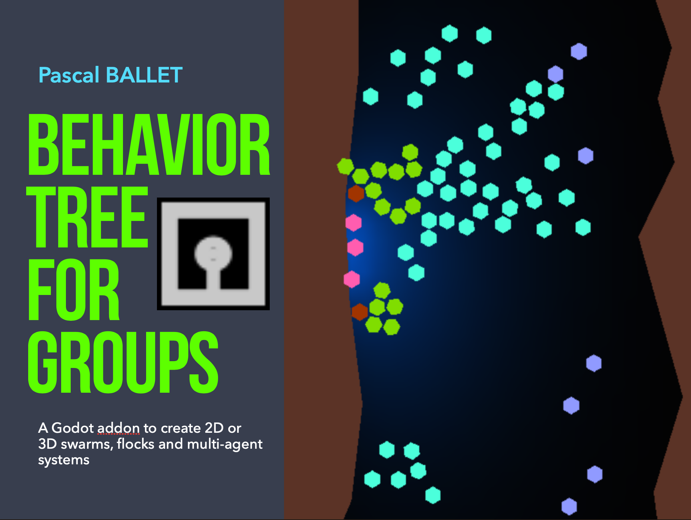

# BehaviorTreeForGroups

**[Behavior Tree For Groups](doc/behavior_tree_for_groups.pdf) is an addon for Godot Engine that enables you to create swarms, flocks and multiagent systems using a single behavior tree.**

**You can easily design collective behaviors without any code by adding groups to your nodes.**

**Several examples, in 2D or 3D, are available: test them to understand how they work and what can be done**

## Simple 2D tutorial
### First, create a new 2D scene
* save it as *main*
### Second, create a new Agent2D
* Click the + button in your scene tree and Select *NewAgent2D* (you can also create your own RigidBody2D)
* Open the *Agent2D.tscn* automatically generated, and select the *RigidBody* at the root of this scene
* In the inspector, go to the *Node Tab* then go to *Group* and add a new group called *test group*
* Save the *Agent2D* scene
* Go back to your *main* scene
### Third, create a simple behavior tree
* Click the *plus button* in your *main* scene, then select the node *BehavTreeForGroups*
* Then, add a new child node called *Behavior*
* In the inspector of the newly created node *Behavior*, in the *Group* property, write *test_group*. That means all the nodes having the Group *test_group* will be treated. 
* Then, as child of the node *Behavior*, add a new node called *TranslateRandom*
### Finally, put about 10 *Agent2D* in your *main* scene
* Drag & drop the file *Agent2D* inside your *main* scene
* Execute your program: all the agents having the group *test_group* will move at random
### Many other nodes exists to create many different behaviors

## Simple 3D tutorial
### Very simple : replace 2D by 3D in the previous example!
* And do not forget to put a camera and a light then execute your program
